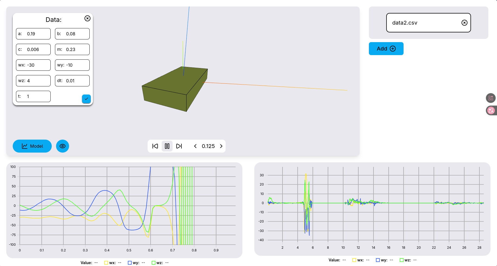
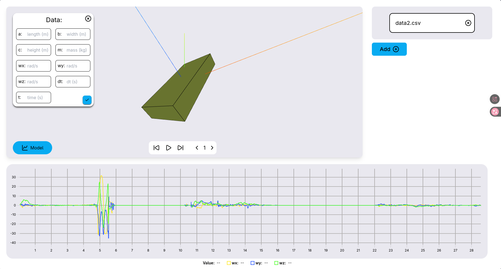

<p align="center">
  
</p>

<h1 align="center">🎾 Prism 3D Simulation</h1>

<p align="center">
  <b>Interactive 3D rigid-body rotation visualizer for investigating the Tennis Racket Theorem</b>
</p>

<p align="center">
  
  
  
  
  
</p>

---

## 📖 About

**Prism 3D Simulation** is a web-based tool built for the **GYPT (German Young Physicists' Tournament)** to investigate the **Tennis Racket Theorem** (also known as the **Dzhanibekov effect** or the **intermediate axis theorem**).

The app lets you upload real gyroscope data recorded from a mobile phone (as CSV), then **replays the rotation in 3D** on a rectangular prism while simultaneously plotting the angular velocity components (ωx, ωy, ωz). You can also enter physical parameters of the object and run a **numerical Euler equation solver** to generate a theoretical model, then **compare** the model prediction side-by-side with the experimental data.

---

## 🔬 Physics Background

### The Tennis Racket Theorem

The **intermediate axis theorem** states that rotation of a rigid body about its intermediate principal axis of inertia is **unstable**. If you toss a rectangular object (like a tennis racket or a phone) spinning around its intermediate axis, it will periodically **flip** — a 180° rotation about the axis with the largest moment of inertia — even in the absence of external torques.

### Euler's Equations of Rotation

The app solves **Euler's equations** for torque-free rotation numerically:

$$I_x \dot{\omega}_x = (I_y - I_z)\,\omega_y\,\omega_z$$

$$I_y \dot{\omega}_y = (I_z - I_x)\,\omega_z\,\omega_x$$

$$I_z \dot{\omega}_z = (I_x - I_y)\,\omega_x\,\omega_y$$

where $I_x, I_y, I_z$ are the principal moments of inertia (computed from the object's dimensions and mass) and $\omega_x, \omega_y, \omega_z$ are the angular velocities about each axis. The forward Euler method is used to step through time, producing a theoretical prediction of how the angular velocities evolve.

---

## ✨ Features

| Feature | Description |
|---|---|
| **3D Rotation Playback** | Upload gyroscope CSV data and watch a 3D prism replay the recorded rotation in real time using Three.js |
| **Angular Velocity Chart** | Interactive time-series chart showing ωx, ωy, ωz components (via µPlot) |
| **Euler Equation Solver** | Enter object dimensions (a, b, c), mass (m), initial angular velocities, time step (dt), and total time to compute theoretical rotation |
| **Model vs. Experiment** | Side-by-side chart comparison of the numerical Euler model against real sensor data |
| **File Management** | CSV upload, multiple files stored in localStorage, quick switching between datasets |
| **Playback Controls** | Play, pause, step forward/backward, frame-by-frame navigation, and speed control |

---

## 📸 Screenshots

<table>
  <tr>
    <td align="center"><b>Model Parameters & 3D View</b></td>
    <td align="center"><b>Model vs. Experiment Comparison</b></td>
  </tr>
  <tr>
    <td></td>
    <td></td>
  </tr>
</table>

---

## 🚀 Getting Started

### Prerequisites

- [Node.js](https://nodejs.org/) (v18+)
- [npm](https://www.npmjs.com/), [yarn](https://yarnpkg.com/), or [bun](https://bun.sh/)

### Installation

```bash
# Clone the repository
git clone https://github.com/BadCoder777/prism-3d-simulation.git
cd prism-3d-simulation

# Install dependencies
npm install
# or
bun install

# Start the development server
npm run dev
# or
bun dev
```

The app will be available at `http://localhost:5173`.

### Build for Production

```bash
npm run build
npm run preview
```

---

## 📋 How to Use

### 1. Prepare Your Data

Record gyroscope data from your mobile phone using any sensor-logging app (e.g., [phyphox](https://phyphox.org/)). Export the data as a **CSV file** with the following column order:

| Column | Index | Description |
|---|---|---|
| `time` | 0 | Timestamp in seconds |
| `wx` | 1 | Angular velocity around x-axis (rad/s) |
| `wy` | 2 | Angular velocity around y-axis (rad/s) |
| `wz` | 3 | Angular velocity around z-axis (rad/s) |
| `absolute` | 4 | Absolute angular velocity (rad/s) |

> **Note:** Column headers in the CSV do not matter — they are automatically mapped by index.

### 2. Upload & Visualize

1. Click the **"Add ➕"** button (top right) and add a `.csv` file
2. Select the uploaded file from the file list to start playback
3. Use the **playback controls** (play/pause, step, frame navigation) at the bottom of the 3D viewport

### 3. Run a Theoretical Model

1. Click the **"📈 Model"** button (bottom left of the 3D viewport)
2. Enter the physical parameters of your object:
   - `a` — length (m)
   - `b` — width (m)
   - `c` — height (m)
   - `m` — mass (kg)
   - `wx`, `wy`, `wz` — initial angular velocities (rad/s)
   - `dt` — time step (s), e.g. `0.01`
   - `t` — total simulation time (s)
3. Confirm with the ✅ button
4. Toggle the **👁 eye icon** to show/hide the model chart alongside the experimental data


---

## 🛠️ Tech Stack

| Technology | Purpose |
|---|---|
| [React 19](https://react.dev/) | UI framework |
| [Three.js](https://threejs.org/) + [React Three Fiber](https://r3f.docs.pmnd.rs/) | 3D rendering & animation |
| [React Three Drei](https://drei.docs.pmnd.rs/) | Three.js helpers & abstractions |
| [µPlot](https://github.com/leeoniya/uPlot) | High-performance time-series charting |
| [Jotai](https://jotai.org/) | Atomic state management |
| [PapaParse](https://www.papaparse.com/) | CSV parsing |
| [react-dropzone](https://react-dropzone.js.org/) | File upload |
| [Lucide React](https://lucide.dev/) | Icon library |
| [Tailwind CSS 3](https://tailwindcss.com/) | Utility-first CSS styling |
| [Vite 7](https://vite.dev/) | Build tool & dev server |
| [TypeScript 5.9](https://www.typescriptlang.org/) | Type safety |

---

## 🎓 GYPT Context

This project was created as a research tool for the **German Young Physicists' Tournament (GYPT)** to experimentally and theoretically investigate the **Tennis Racket Theorem**. The workflow is:

1. **Experiment** — Toss a phone (or an object with a phone attached) so it spins around its intermediate axis, recording gyroscope data
2. **Analyze** — Upload the CSV to this app, visualize the rotation in 3D, and observe the characteristic flipping behavior in the ω-charts
3. **Model** — Enter the object's physical parameters, run the Euler equation solver, and compare the theoretical prediction with experimental data
4. **Conclude** — Validate the intermediate axis theorem by showing agreement (or discrepancy) between model and experiment

---

## 📄 License

This project is open source. Feel free to use, modify, and distribute.

---

<p align="center">
  Made with ❤️ for physics and the <b>GYPT</b>
</p>
